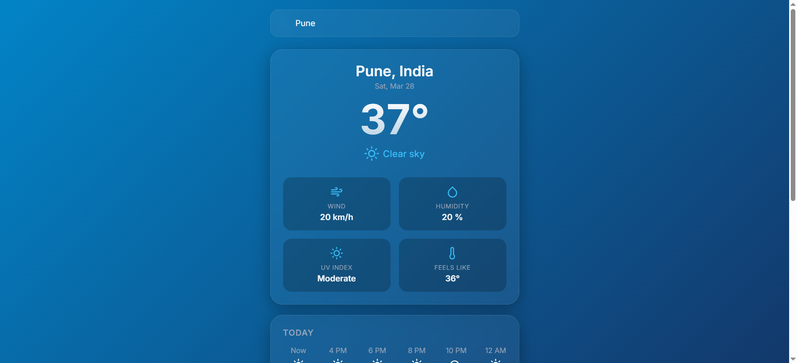
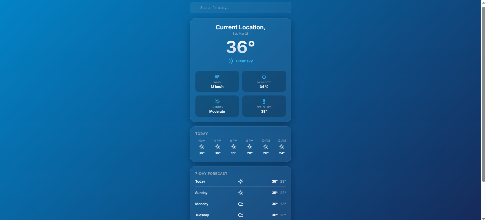

# 🌤️ Weather App

A beautiful, responsive, and lightweight static weather application that helps you stay updated with current weather conditions, an hourly forecast, and a 7-day outlook. 

## 📸 Screenshots

| Desktop View | Mobile View |
|:---:|:---:|
|  |  |

*(Please save your screenshots in the `assets/` folder as `screenshot1.png` and `screenshot2.png` to display them here!)*

## ✨ Features

- **Current Weather**: Displays accurate temperature, weather condition, wind speed, humidity, UV index, and "feels like" temperature.
- **Hourly Forecast**: See what the weather will be like for the next 24 hours at a glance.
- **7-Day Forecast**: Plan ahead with a comprehensive daily forecast.
- **Geolocation Support**: Automatically fetches the weather for your current location on load.
- **City Search**: Quickly look up weather details for any city around the world.
- **Dynamic Icons**: Beautiful and clean weather icons powered by [Feather Icons](https://feathericons.com/).

## 💻 Technologies Used

- **HTML5** & **CSS3**: For structure and responsive, vibrant styling.
- **Vanilla JavaScript**: For logic and DOM manipulation (no frameworks).
- **[Open-Meteo API](https://open-meteo.com/)**: Free, open-source API for geocoding and weather data without rate limits.

## 🚀 How to Run

Because this is a static web application built purely with frontend technologies, no web server or build step is required!

1. Clone the repository:
   ```bash
   git clone https://github.com/atharvadhabu-netizen/weatherApp.git
   ```
2. Open the project folder.
3. Simply double-click on `index.html` to open it in your default web browser.

## 🤝 Contributing
Contributions, issues, and feature requests are welcome! Feel free to check the issues page if you want to contribute.
